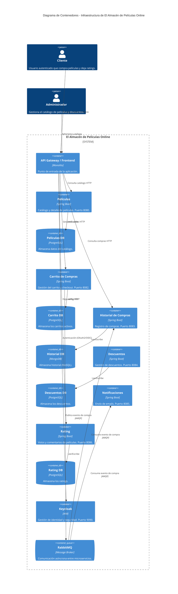

# Infraestructura - El Almacén de Películas Online

Este repositorio contiene la configuración de la infraestructura y orquestación de los microservicios (verticales) del sistema "El Almacén de Películas Online", dando cumplimiento al requerimiento **RT-9** sobre la documentación de los servicios, sus puertos HTTP y los eventos que se consumen/publican.

## Propósito

El propósito de este repositorio es proveer el entorno de ejecución centralizado utilizando **Docker Compose**. Aquí se levantan y conectan todos los microservicios, bases de datos (PostgreSQL y MongoDB), el gestor de identidad (Keycloak) y el broker de mensajería (RabbitMQ) necesarios para el funcionamiento de la aplicación.

## Servicios Expuestos (HTTP)

La infraestructura orquesta los siguientes microservicios y expone los siguientes puertos:

| Servicio / Vertical | Contenedor | Puerto Expuesto | Base de Datos |
|---------------------|----------------------|-----------------|---------------------|
| **Películas** | `peliculas-app` | `8080` | PostgreSQL (5432) |
| **Carrito** | `carrito-app` | `8082` | PostgreSQL (5433) |
| **Historial** | `historial-app` | `8083` | MongoDB (27017) |
| **Descuentos** | `descuentos-app` | `8084` | PostgreSQL (5436) |
| **Notificaciones** | `notificaciones-app` | `8085` | N/A |
| **Rating** | `rating-app` | `8086` | PostgreSQL (5435) |
| **Keycloak (Auth)** | `keycloak` | `9090` | PostgreSQL |
| **RabbitMQ** | `rabbitmq` | `15672` (Admin) | N/A |

## Eventos (Publicación y Consumo)

La comunicación asíncrona entre los microservicios se realiza a través de **RabbitMQ**, manejando los siguientes flujos de eventos:

- **Notificaciones:** 
  - **Consume:** Eventos de compra para el envío de correos.
  - **Exchange:** `compra.exchange`
  - **Routing Key:** `compra.event`
  - **Queue:** `compras.notificaciones.queue`

- **Descuentos:**
  - **Publica/Consume:** Eventos relacionados a la gestión de descuentos.
  - **Exchange:** `descuento_exchange`
  - **Routing Key:** `descuento_routing_key`

## Diagrama C4 (Contexto)

A continuación se presenta un diagrama de contenedor (Nivel 2 de C4) que ilustra la arquitectura de la infraestructura orquestada:



## Instrucciones de Uso

Para levantar toda la infraestructura de la aplicación en modo desarrollo (incluyendo bases de datos, RabbitMQ y Keycloak), ejecutar el siguiente comando desde la raíz de este directorio:

```bash
docker-compose up -d --build
```

Para detener y eliminar los contenedores:

```bash
docker-compose down
```
